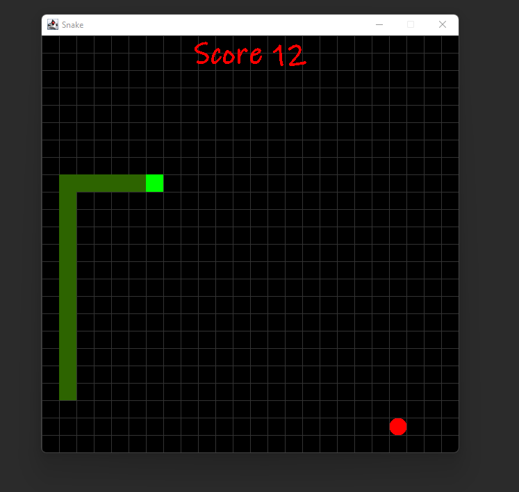
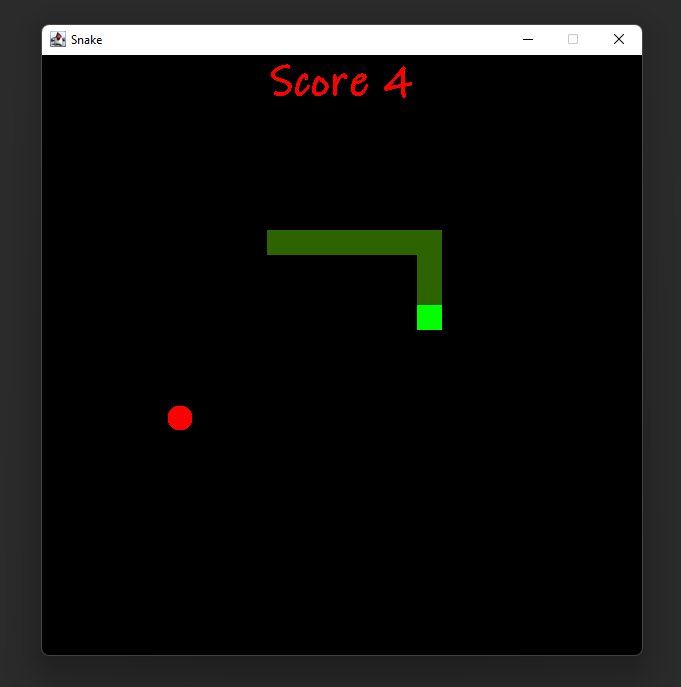
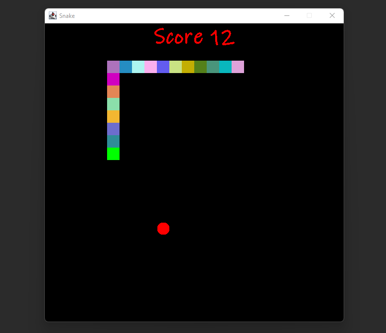

# Snake

- Serpente (Snake, também conhecido como "jogo da cobrinha") é um jogo que ficou conhecido por diversas versões cuja versão inicial começou com o jogo Blockade de 1976,
sendo feitas várias imitações em vídeo-games e computadores. 

<h1 align="center">

</h1>

### Game Over

- A variável  `static final int DELAY = 75;` é responsável pela velocidade da cobrinha se estiver muito rápido você pode amentar o tempo de delay,
e se tiver muito lento pode diminuir.
- O jogo encerra ao tocar nas bordas ou em seu proprio corpo, exibindo a mensagem de game over.

<h1 align="center">

</h1>


### Linhas de Grade
Você pode remover as linhas de grade comentando ou removendo esse trecho de código

```java
for (int i = 0; i < SCREEN_HEIGHT / UNIT_SIZE; i++) {
    g.drawLine(i * UNIT_SIZE, 0, i * UNIT_SIZE, SCREEN_HEIGHT);
    g.drawLine(0, i * UNIT_SIZE, SCREEN_WIDTH, i * UNIT_SIZE);
}
```

<h1 align="center">

</h1>

### Cobrinha colorida

 Se você quiser usar a cobra com a coloração colorida, remova o comentando ou removendo esse trecho de código
 
 ```java
 g.setColor(new Color(random.nextInt(255), random.nextInt(255),random.nextInt(255)));
 ```
 
 <h1 align="center">

</h1>


 ### Executando a aplicação
 
 - Necessário ter o [JDK](https://www.oracle.com/br/java/technologies/javase/javase8-archive-downloads.html) (Java Development Kit) instalado em seu computador,
 configurado em sua IDE de preferência ou em sua variável de ambiente [PATH](https://www.java.com/pt-BR/download/help/path_pt-br.html) para poder execuar ela em seu terminal.
 - Em sua IDE rode a aplicação pela classe `SnakeGame.java` pois ela contém o método main para executar a aplicação.
- Executando pelo terminal:

```
git clone https://github.com/wmaidson/snake.git

cd src

javac *.java

java SnakeGame
```
